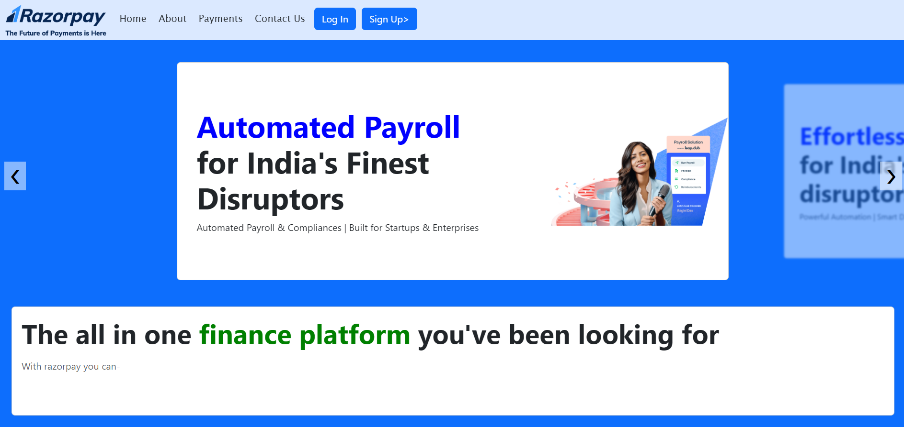

# Razorpay Concept Clone

Welcome to the Razorpay Concept Clone project! This is a concept implementation of the Razorpay payment gateway interface, designed to demonstrate a modern, responsive, and user-friendly UI. The project is built using HTML, CSS, and Bootstrap, with a focus on providing a seamless user experience.

## Features

- **Responsive Design**: The interface adapts to different screen sizes and devices.
- **Modern UI**: Inspired by Razorpay, with a clean and intuitive layout.
- **Form Handling**: Includes forms for capturing user details.
- **Custom Styling**: Utilizes custom CSS for unique styling elements.

## Screenshots

## Getting Started

### Prerequisites

Before you begin, ensure you have met the following requirements:

- A modern web browser
- Basic knowledge of HTML, CSS, and Bootstrap

